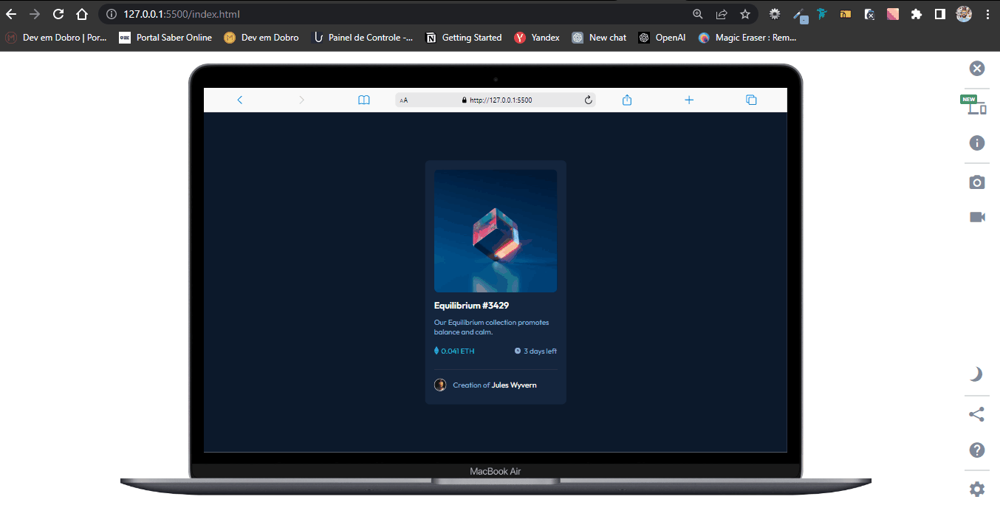

# NFT Preview Card

## Bem-Vindos! 👋

Este é um projeto de exemplo para criar um componente de cartão de visualização NFT usando HTML, CSS e JavaScript. O cartão tem um efeito de hover que adiciona outra imagem por cima da imagem existente.

## Funcionalidades

- Mostra uma imagem do NFT
- Exibe o nome e descrição do NFT
- Adiciona outra imagem por cima da imagem existente ao passar o mouse sobre o cartão

## Como executar o projeto

- Clone este repositório em seu computador usando o comando git clone https://github.com/vandesonsantos/NFT-Preview-Card.git no terminal ou prompt de comando.

- Abra o arquivo index.html em seu navegador para visualizar o cartão NFT.
- Abra o arquivo style.css e script.js em seu editor de código para ver o código do projeto.

## Contribuição

Sinta-se à vontade para contribuir com este projeto, enviando pull requests com melhorias ou correções de bugs.

## Veja o Projeto Online
Deploy Do Projeto
- [GitHub Pages](https://vandesonsantos.github.io/NFT-Preview-Card/)  

**Divirta-se!** 🚀
